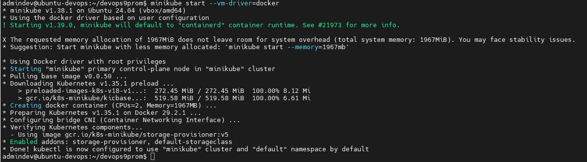
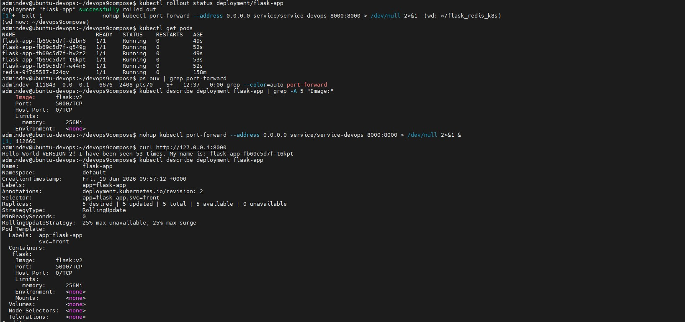
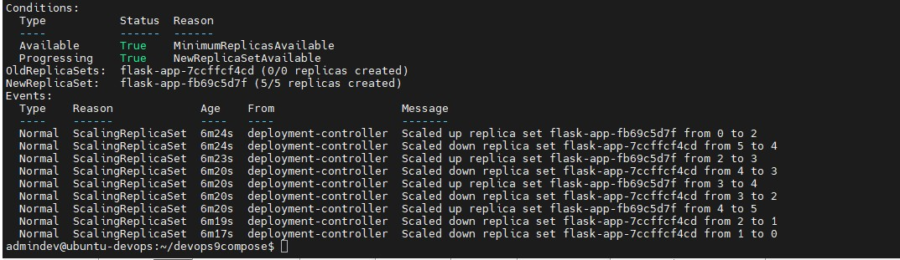
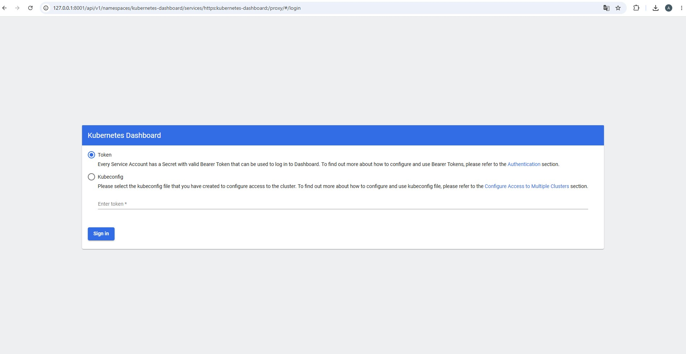
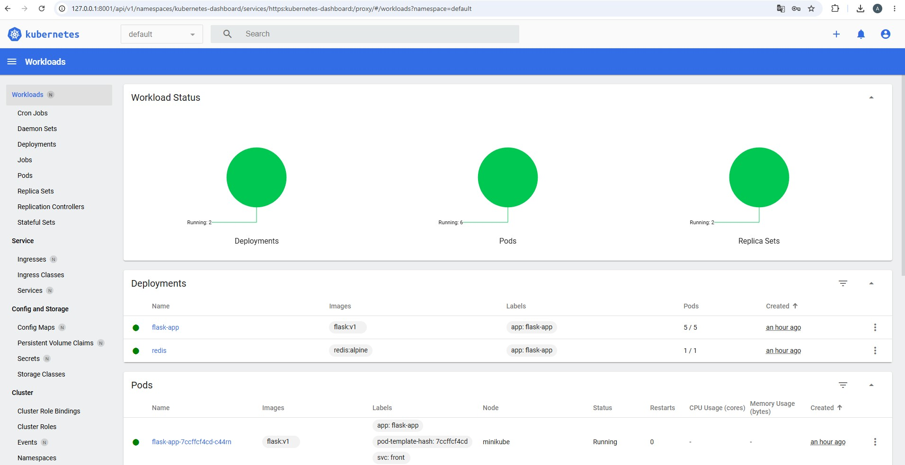
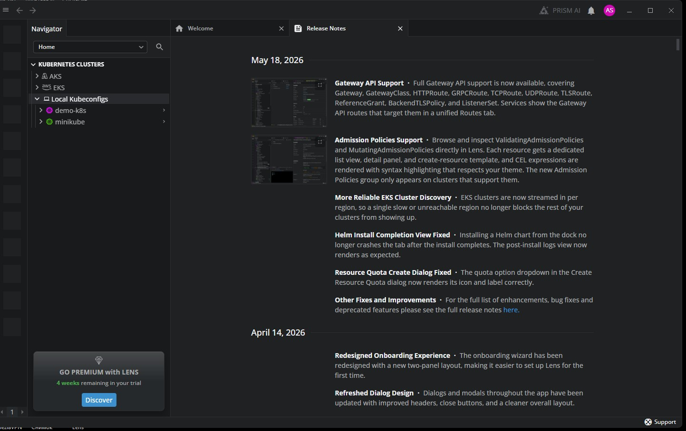
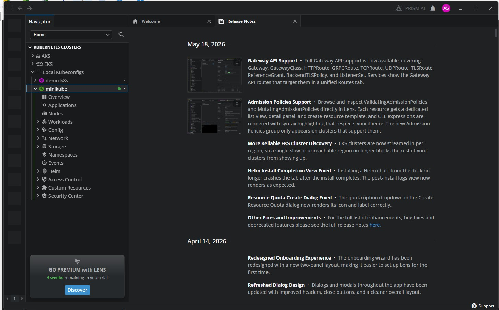

# DevOps Lab 09 — Kubernetes Basics

## Описание проекта

Развёртывание приложения Flask + Redis в кластере Kubernetes (minikube) с использованием:
- Deployment (5 реплик Flask, 1 реплика Redis)
- Service (LoadBalancer для Flask, ClusterIP для Redis)
- Rolling Update (обновление версии приложения)

## Архитектура
User → flask-service (LoadBalancer:8000) → [5x flask-app pods] → redis-service (ClusterIP:6379) → redis pod
plain

## Структура проекта
```
flask_redis_k8s/
├── flask.yml              # Deployment Flask
├── flask-service.yml      # Service Flask (LoadBalancer)
├── redis.yml              # Deployment Redis
├── redis-service.yml      # Service Redis (ClusterIP)
└── README.md              # Этот файл
```
plain

---

## Основное задание

### 1. Установка minikube

```bash
# Установка kubectl
curl -LO "https://dl.k8s.io/release/$(curl -L -s https://dl.k8s.io/release/stable.txt)/bin/linux/amd64/kubectl"
sudo install -o root -g root -m 0755 kubectl /usr/local/bin/kubectl

# Установка minikube
curl -LO https://storage.googleapis.com/minikube/releases/latest/minikube_latest_amd64.deb
sudo dpkg -i minikube_latest_amd64.deb

# Запуск minikube
sudo usermod -aG docker $USER && newgrp docker
sudo swapoff -a
minikube start --vm-driver=docker
2. Проверка статуса кластера
bash
minikube status
kubectl get nodes
3. Сборка и загрузка образов
bash
# Сборка образа Flask внутри minikube
minikube image build -t flask:v1 flask_redis/

# Или загрузка готового образа
docker build -t flask:v1 /home/admindev/devops-lab08/flask-redis/
minikube image load flask:v1

# Загрузка Redis
minikube image load redis:alpine
4. Применение манифестов
bash
kubectl apply -f ~/flask_redis_k8s/
5. Проверка развёртывания
bash
kubectl get pods
kubectl get services
kubectl get deployments
6. Настройка доступа извне
bash
# В отдельном окне терминала
minikube tunnel --bind-address 10.0.2.15
Проверка в браузере: http://127.0.0.1:8000
Rolling Update
Подготовка новой версии
Изменить app.py — добавить VERSION 5! в строку return
Пересобрать образ:
bash
docker build --no-cache -t flask:v5 /home/admindev/devops-lab08/flask-redis/
minikube image load flask:v5
Обновление deployment
bash
# Способ 1: Через kubectl set image
kubectl set image deployments/flask-app flask=flask:v5

# Способ 2: Через kubectl patch
kubectl patch deployment flask-app -p '{"spec":{"template":{"spec":{"containers":[{"name":"flask","image":"flask:v5"}]}}}}'

# Способ 3: Через kubectl edit
kubectl edit deployment flask-app
# Изменить image: flask:v1 на image: flask:v5
Проверка обновления
bash
# Смотрим статус rollout
kubectl rollout status deployment/flask-app

# Смотрим историю версий
kubectl rollout history deployment/flask-app

# Проверяем поды
kubectl get pods -w

# Проверяем в браузере
curl http://10.0.2.15:8000
Откат к предыдущей версии (undo)
bash
# Откат на предыдущую версию
kubectl rollout undo deployment/flask-app

# Откат на конкретную ревизию
kubectl rollout undo deployment/flask-app --to-revision=1
Опциональные задания
Опция 1: Подключение через Lens
Lens — Kubernetes IDE для визуального управления кластером.
Установка
Скачать с https://k8slens.dev/
Установить на Windows
Настройка подключения
bash
# На VM: скопировать конфиг и сертификаты на хост
# В PowerShell на хосте:
scp -P 2222 admindev@127.0.0.1:/home/admindev/.kube/config D:\k8s-config\
scp -P 2222 admindev@127.0.0.1:/home/admindev/.minikube/ca.crt D:\k8s-config\
scp -P 2222 admindev@127.0.0.1:/home/admindev/.minikube/profiles/minikube/client.crt D:\k8s-config\
scp -P 2222 admindev@127.0.0.1:/home/admindev/.minikube/profiles/minikube/client.key D:\k8s-config\
Правка конфига
Открыть config в текстовом редакторе, заменить пути:
yaml
certificate-authority: D:\k8s-config\ca.crt
client-certificate: D:\k8s-config\client.crt
client-key: D:\k8s-config\client.key
server: https://127.0.0.1:8443
Проброс портов в VirtualBox
Table
Имя	Протокол	Адрес хоста	Порт хоста	Адрес гостя	Порт гостя
k8s-api	TCP	127.0.0.1	8443	10.0.2.15	8443
Добавление в Lens
File → Add Cluster → Browse → выбрать config
Или Lens автоматически подхватывает C:\Users\<user>\.kube\config
Что можно смотреть в Lens
Workloads → Pods — статус подов, логи, терминал
Workloads → Deployments — реплики, стратегия обновления
Network → Services — типы сервисов, endpoints
Config → Namespaces — пространства имён
Опция 2: Service Selectors и Labels (dev/prod/test)
Добавление label env к deployment
yaml
# flask-dev.yml
apiVersion: apps/v1
kind: Deployment
metadata:
  name: flask-app-dev
  labels:
    app: flask-app
    env: dev
spec:
  replicas: 2
  selector:
    matchLabels:
      app: flask-app
      env: dev
  template:
    metadata:
      labels:
        app: flask-app
        env: dev
        svc: front
    spec:
      containers:
      - name: flask
        image: flask:v1
        ports:
        - containerPort: 5000
Сервис только для dev-подов
yaml
# flask-service-dev.yml
apiVersion: v1
kind: Service
metadata:
  name: service-devops-dev
spec:
  type: LoadBalancer
  selector:
    app: flask-app
    env: dev
    svc: front
  ports:
  - port: 8000
    targetPort: 5000
  externalIPs:
  - 10.0.2.15
Применение и проверка
bash
kubectl apply -f flask-dev.yml
kubectl apply -f flask-service-dev.yml

kubectl get pods --show-labels
kubectl get services
Опция 3: Ingress Controller
Ingress — маршрутизация HTTP-трафика по именам хостов.
Установка Ingress в minikube
bash
minikube addons enable ingress
Манифест Ingress
yaml
# ingress.yml
apiVersion: networking.k8s.io/v1
kind: Ingress
metadata:
  name: flask-ingress
  annotations:
    nginx.ingress.kubernetes.io/rewrite-target: /
spec:
  rules:
  - host: flask.local
    http:
      paths:
      - path: /
        pathType: Prefix
        backend:
          service:
            name: service-devops
            port:
              number: 8000
Применение
bash
kubectl apply -f ingress.yml

# Проверка
kubectl get ingress
Доступ через hosts
Добавить в C:\Windows\System32\drivers\etc\hosts:
plain
127.0.0.1 flask.local
Опция 4: Rollout History и Undo
bash
# История версий
kubectl rollout history deployment/flask-app

# Подробности ревизии
kubectl rollout history deployment/flask-app --revision=2

# Откат на предыдущую
kubectl rollout undo deployment/flask-app

# Откат на конкретную версию
kubectl rollout undo deployment/flask-app --to-revision=1

# Пауза rollout
kubectl rollout pause deployment/flask-app

# Возобновление
kubectl rollout resume deployment/flask-app
Результат
После обновления приложение отображает:
plain
Hello World VERSION 5! I have been seen XX times. My name is: flask-app-XXXXX
Полезные команды
bash
# Описание ресурса
kubectl describe pod <pod-name>
kubectl describe deployment flask-app
kubectl describe service service-devops

# Логи пода
kubectl logs <pod-name>
kubectl logs -f <pod-name>  # следить в реальном времени

# Терминал внутри пода
kubectl exec -it <pod-name> -- /bin/sh

# Проброс портов для отладки
kubectl port-forward pod/<pod-name> 5000:5000

# Удаление ресурсов
kubectl delete -f flask_redis_k8s/
# или
kubectl delete deployment flask-app
kubectl delete service service-devops
kubectl delete deployment redis
kubectl delete service redis

Скриншоты

### Запуск minikube


### Rolling Update — статус подов


### Rolling Update — история событий


### Kubernetes Dashboard — логин


### Kubernetes Dashboard — Workloads


### Lens — подключение к minikube


### Lens — структура кластера
